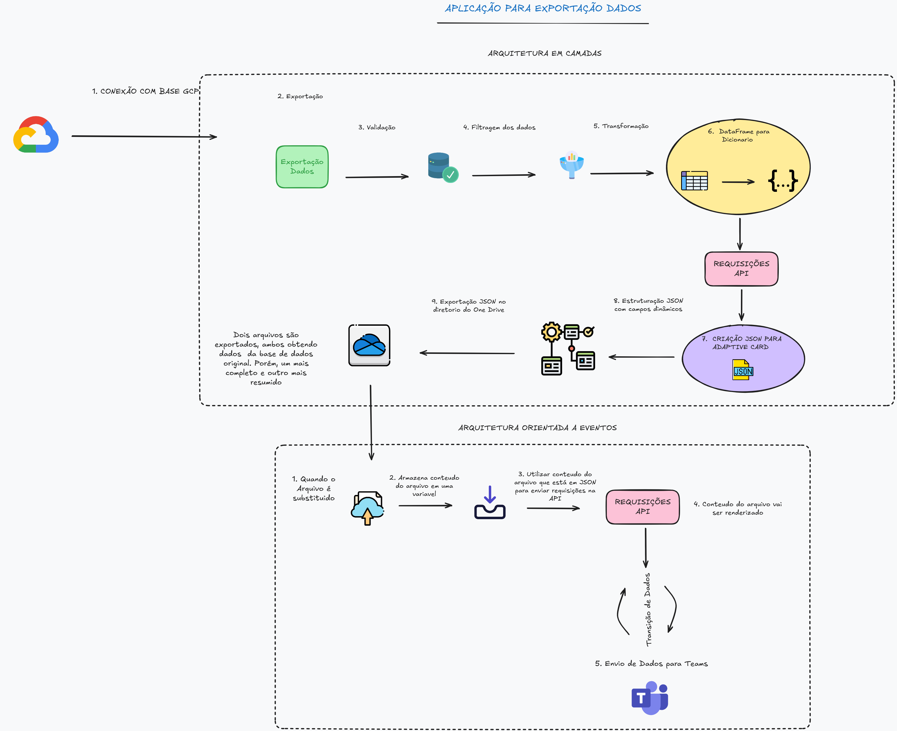

# 🌐 Sistema de Mensageria para Governça e Comunicação de Dados

🎯 1. Objetivo do Sistema
---

Desenvolver uma aplicação que realiza:

* Coleta de Dados analiticos através de uma banco de dados da nuvem GCP (Google Cloud Platform).
* Realização de toda uma camada de processamento, transformação e filtragem nos dados coletados
* Aplicaçaõ de Regras de negócios nesses dados
* Consumo de APIs do Microsoft Teams
* Envio de Relatorios informacionais para monitoramento das informações

---

✍🏾 2. System Design
---

### Arquitetura do Sistema

O projeto seguiu um padrão de arquitetura MVC (ModelO - Visão - Controlador) Model para dados e lógica de negócios, Visão para a interface do usuário e Controlador para processar a entrada do usuário e conectar o modelo e a visão. Desta forma, iremos conseguir trazer determinados ganhos para aplicação. São eles:

* Separação de Responsabilidades
* Facilidade na manutenção
* Reutilização de código
* Desenvolvimento Paralelo

# 

### Diagrama

---

## ⚙️ 3. Ferramentas Utilizadas

A seguir estão as principais tecnologias, frameworks e bibliotecas utilizadas no desenvolvimento de sistema:

| Camada         | Tecnologia       |                                  
|------------------|----------------
| Back - end               | Python e SQL
| Front - End            | HTML e JSON (Adaptive Card)           
| Banco de Dados        | Bigquery               
| Versionamento     | Git e GitHub         
| Documentação   | Markdown

---

## ✅ 4. Conclusão

O Sistema de Mensageria para Governça e Comunicação de Dados foi desenvolvido com o objetivo de oferecer uma solução escalaval, eficiente e performática para um equipe de analyticks acompanhar as informações de um determinado indicador. Com a implementação de recursos como envio de relatorio informacional de hora em hora, tratativa nos dados e utilização de JSON para criação de um adaptive card e trafegar os dados entre a camada de dados e front. O sistema proporciona uma base sólida para:

* Acompanhamento hora em hora dos dados;

* Melhor tomada de decisão com base em dados;

* A estrutura modular baseada no MVC permite que o sistema seja facilmente escalável e adaptável para novas funcionalidades.
